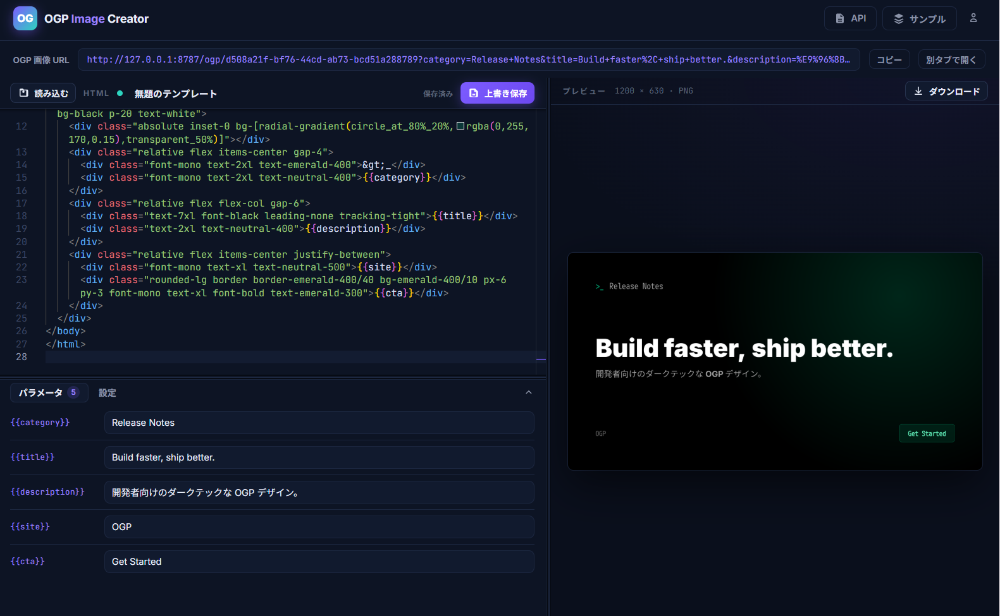

# ogp-image-creator



HTML を編集するだけで OGP（Open Graph Protocol）画像を生成できるアプリケーションです。ブラウザ上で HTML を編集し、その内容を [satoru-render](https://github.com/SoraKumo001/satoru)（WASM ベースの HTML/CSS → 画像変換エンジン）でレンダリングして画像を返します。

Cloudflare Workers 上で動作し、ヘッドレスブラウザ（Chromium/Puppeteer）を一切必要としません。

## 特徴

- **HTML エディタ** — Monaco エディタによるシンタックスハイライト・行番号付き編集
- **ライブプレビュー** — ブラウザ内で satoru-render を直接実行し、編集内容を即時プレビュー
- **外部リソース解決** — フォント・画像は `/api/proxy` 経由で取得（CORS 回避）
- **テンプレート保存/再利用** — Cloudflare KV に保存し、一覧・読込・削除が可能
- **OGP 画像配信** — 保存したテンプレートを `/ogp/:id` で PNG 配信（クローラ向け）
- **PNG ダウンロード** — プレビュー画像をそのままダウンロード

## 使い方

### 1. セットアップとログイン

このリポジトリをCloudflareにデプロイするだけで動きます。データの保存に使うKVは自動生成されます。

初回起動時はセットアップ画面が表示されます。管理者の ID とパスワードを登録すると、以降はその認証情報でログインして編集画面を利用できます。

### 2. HTML を編集する

左側の Monaco エディタで HTML / CSS を編集します。編集内容は自動でプレビューに反映されます（デバウンス 500ms）。画像サイズ（幅 × 高さ）と出力形式（PNG / WebP / SVG）は上部ツールバーで変更できます。

### 3. パラメータ（マクロ）機能

HTML 内に `{{キー名}}` の形式でプレースホルダーを書くと、エディタ下部の「パラメータ」パネルにそのキーに対応する入力欄が自動で表示されます。入力欄の値を変更すると、プレビューに即時反映されます。

```html
<div class="kicker">{{category}}</div>
<h1>{{title}}</h1>
<p class="desc">{{description}}</p>
```

- キー名は英数字とハイフン（`-`）が使えます（例: `{{site-name}}`）
- 同じキーを複数箇所に書くと、すべて同じ値で置換されます
- 値が未入力のキーは `{{キー名}}` のまま残ります
- パラメータパネルは開閉でき、キー数も表示されます

### 4. テンプレートを保存する

「保存」ボタンでテンプレートに名前を付けて保存します。保存すると一意の ID が発行され、ヘッダー下に OGP 画像 URL が表示されます。保存済みテンプレートは「テンプレート」ボタンから一覧表示・読み込み・削除ができます。

### 5. OGP 画像 URL を共有する

保存後に表示される URL（`/ogp/:id`）を SNS やブログの OGP 画像として指定します。URL にクエリを付けると、保存時のパラメータ値を上書きできます。

```
/ogp/abc123?title=新しいタイトル&category=News
```

- `w` / `h` … 画像サイズの上書き
- `format` … 出力形式（`png` / `webp` / `svg`）
- その他のクエリ … マクロキー名として解釈され、`{{キー名}}` を置換

「コピー」ボタンで URL をクリップボードにコピー、「別タブで開く」で実際の画像を確認できます。

### 6. 画像をダウンロードする

「ダウンロード」ボタンで、現在のプレビュー画像を PNG / WebP / SVG として保存できます。

## 技術スタック

| レイヤ         | 技術                                                                                   |
| -------------- | -------------------------------------------------------------------------------------- |
| バックエンド   | Cloudflare Workers + [Hono](https://hono.dev/)                                         |
| レンダリング   | [satoru-render](https://www.npmjs.com/package/satoru-render)（WASM / Skia + litehtml） |
| フロントエンド | React + Vite + Monaco Editor                                                           |
| ストレージ     | Cloudflare KV（テンプレート保存）                                                      |

## セットアップ

```bash
# 依存のインストール
pnpm install

# フロントエンドのビルド（public/ に出力）
pnpm build

# ローカル開発サーバー起動（http://localhost:8787）
pnpm dev
```

## デプロイ

KV ネームスペースは Wrangler の「自動プロビジョニング」を利用しています。`wrangler.jsonc` の `kv_namespaces` に `id` を指定していないため、`wrangler deploy` 時に KV ネームスペースが自動作成され、その ID が設定ファイルに書き戻されます。

```bash
pnpm deploy
```

> 補足: ダッシュボード（GitHub 連携など）からデプロイした場合もリソースは自動作成されますが、ID はリポジトリに書き戻されずダッシュボード上でのみ確認できます。

## API

| メソッド | パス                 | 説明                           |
| -------- | -------------------- | ------------------------------ |
| `POST`   | `/api/render`        | HTML を画像にレンダリング      |
| `GET`    | `/ogp/:id`           | 保存済みテンプレートを画像配信 |
| `GET`    | `/api/proxy?url=`    | 外部リソース取得（CORS 回避）  |
| `GET`    | `/api/templates`     | テンプレート一覧               |
| `POST`   | `/api/templates`     | テンプレート保存               |
| `GET`    | `/api/templates/:id` | テンプレート取得               |
| `DELETE` | `/api/templates/:id` | テンプレート削除               |

### `POST /api/render`

```json
{
	"html": "<h1>Hello OGP</h1>",
	"width": 1200,
	"height": 630,
	"format": "png",
	"params": { "title": "こんにちは" }
}
```

- `width` / `height` は省略可（デフォルト 1200 × 630）
- `format` は `png` / `webp` / `svg`（デフォルト `png`）
- `params` は `{{key}}` マクロの置換値（省略可）

### `GET /ogp/:id`

保存済みテンプレートを画像として配信します。クエリで上書き可能です。

```
/ogp/:id?w=1200&h=630&format=png&title=Hello
```

- `w` / `h` … 画像サイズの上書き
- `format` … 出力形式（`png` / `webp` / `svg`）
- その他のクエリ … マクロキー名として解釈され、`{{キー名}}` を置換

## プロジェクト構成

```
.
├── src/                 # Worker バックエンド（Hono）
│   └── index.ts
├── frontend/            # フロントエンド（React + Vite）
│   ├── index.html
│   └── src/
├── public/              # ビルド成果物（assets binding で配信）
├── test/                # テスト（Vitest）
├── wrangler.jsonc       # Wrangler 設定
└── vite.config.mts      # Vite 設定
```

## スクリプト

| コマンド          | 説明                      |
| ----------------- | ------------------------- |
| `pnpm dev`        | ローカル開発サーバー起動  |
| `pnpm build`      | フロントエンドをビルド    |
| `pnpm test`       | テスト実行                |
| `pnpm cf-typegen` | Wrangler の型定義を再生成 |
| `pnpm deploy`     | Cloudflare にデプロイ     |

## 制限事項

作成可能なイメージは satoru-render の制限に準じます。ただ、基本的にブラウザ上で一般的に使用されているCSSや画像形式(WebPやAvifなど)は網羅しています。

問題はCloudflareの10ms制限で、これは確実に超過します。アクセス数が少ない場合やキャッシュのヒットミスが少ない場合(同じOGPイメージに対するアクセス)はそのまま見過ごされますが、そうで無い場合は$5のPaidプランを選択しないと制限に引っかかる可能性が高いです。
